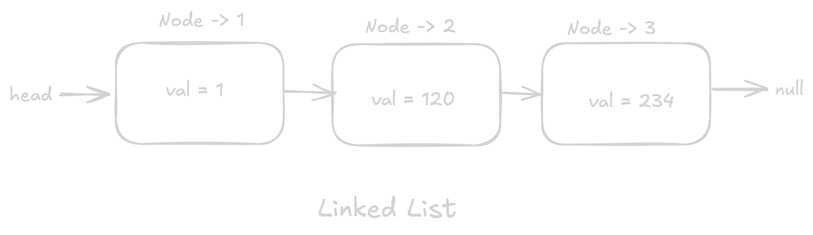

# Linked List: Implementation

Implement a linked list.

Linked list should support the following operations:

- `insert(value)`: Insert a new node with the given value at the end of the list.
- `remove(value)`: Remove the node with the given value from the linked list, if it exists.
- `search(value)`: Search for the node with the given value in the linked list, if it exists.
- `print()`: Print the values in the linked list.

## Constraints

- You are not allowed to use any built-in libraries for the implementation of the linked list.
- You are not allowed to use any data structures like arrays, objects, etc.
