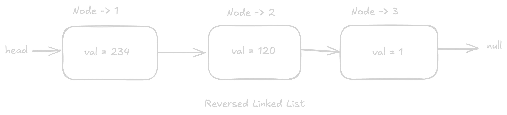

## Question

Given a linked list, reverse it.




## Requirements

- A helper linked list implementation is given to you.
- You need to reverse the linked list.

## Examples

```text
Example 1:
  Input: 1 -> 2 -> 3 -> 4 -> 5
  Output: 5 -> 4 -> 3 -> 2 -> 1

Example 2:
  Input: 1 -> 2
  Output: 2 -> 1

Example 3:
  Input: 234 -> 567 -> 890 -> 343 -> 454 -> 234
  Output: 234 -> 454 -> 343 -> 890 -> 567 -> 234
```
