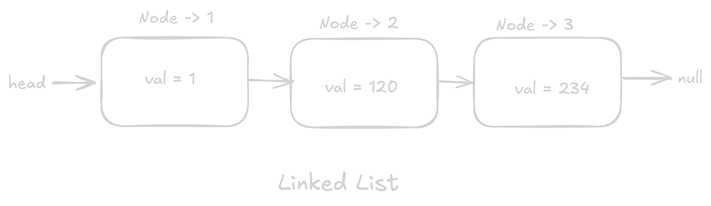
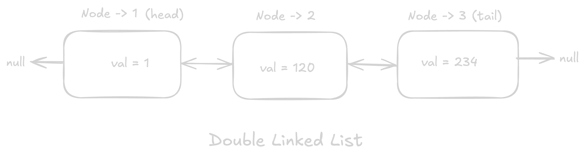
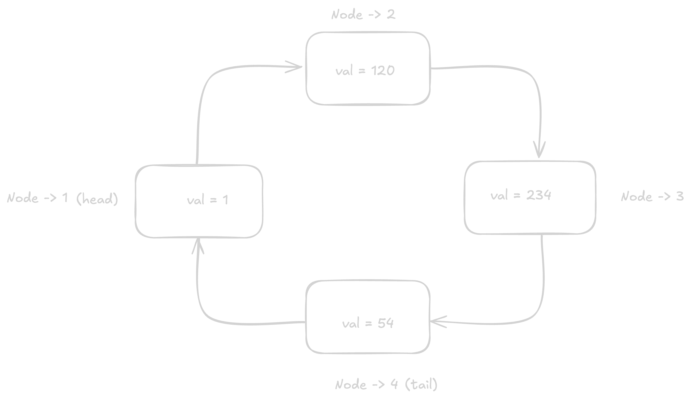
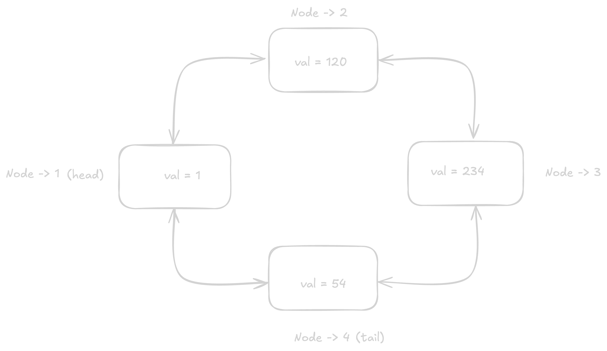

# What is a Linked List?

> Linked List is a linear data structure. It is a collection of nodes. Each node contains a value and a pointer to the next node in the list.

## Answer

A linked list is a linear data structure where each element is a separate object, called a node. Each node contains a value and a reference (or pointer) to the next node in the list. The list elements are stored in memory without any need for contiguous memory allocation.

## Types of Linked List

1. Singly Linked List
2. Doubly Linked List
3. Circular Linked List
4. Circular Doubly Linked List

## Singly Linked List

> In a singly linked list, each node points to the next node in the list. The last node points to null.

## Doubly Linked List

> In a doubly linked list, each node points to the next node in the list and the previous node in the list. The last node points to the first node in the list.

## Circular Linked List

> In a circular linked list, the last node points to the first node in the list.

## Circular Doubly Linked List

> In a circular doubly linked list, the last node points to the first node in the list and the first node points to the last node in the list.

## Operations on Linked List

1. **Insertion**: Insertion is the process of adding a new node to the linked list.
2. **Deletion**: Deletion is the process of removing a node from the linked list.
3. **Search**: Search is the process of finding a node in the linked list.
4. **Traversal**: Traversal is the process of visiting all the nodes in the linked list.
5. **Sorting**: Sorting is the process of arranging the nodes in the linked list in a specific order.
6. **Merging**: Merging is the process of combining two linked lists into one.

## When to use a linked list?

1. When you need a dynamic size.
2. When you need to insert or delete elements frequently.
3. When you need to traverse the list frequently.
4. When you need to sort the list frequently.
5. When you need to merge two lists frequently.

## Follow Up Questions

### What are the benefits of using a linked list?

1. **Dynamic Size**: One of the most significant advantages of linked lists is that they can grow and shrink at runtime by allocating and deallocating memory as needed. This makes them more flexible than arrays, which have a fixed size.
2. **Ease of Insertion and Deletion**: Inserting or deleting a node from a linked list is straightforward. You just need to change the pointers of the adjacent nodes, unlike in arrays where you might need to shift elements to fill in the gap.
3. **No Memory Wastage**: In a linked list, memory is allocated as you add elements. When you remove an element, the memory is deallocated. This makes it more efficient in terms of memory usage compared to arrays.
4. **Easy to Implement**: Linked lists are relatively easy to implement compared to other data structures like trees or graphs. This makes them a good choice for beginners learning about data structures.

### What are the drawbacks of using a linked list?

1. **Random Access is Not Possible**: Unlike arrays, you cannot access elements in a linked list randomly. You need to traverse the list from the beginning until you reach the desired element. This makes it less efficient for certain operations compared to arrays.
2. **Extra Memory Overhead**: Each node in a linked list requires extra memory to store the pointer. This can be a significant overhead if the list is large.
3. **Not Cache Friendly**: Linked lists are not cache-friendly. This means that accessing elements in a linked list can be slower than accessing elements in an array because the cache might not be used efficiently.
4. **Slower Access Time**: Accessing elements in a linked list is slower compared to arrays because you need to traverse the list to find the desired element.
5. **More Complex Implementation**: Linked lists require more complex implementation compared to arrays. This can lead to more bugs and less performance.
