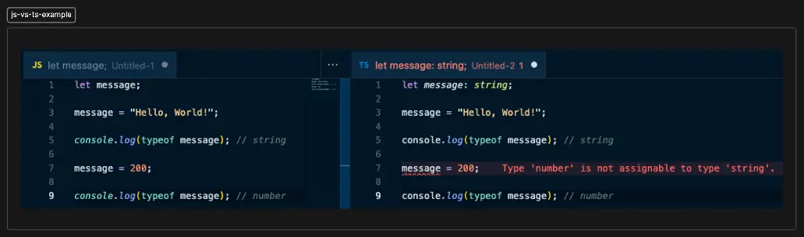
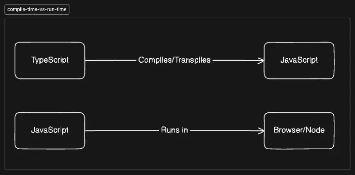

import Callout from '@/components/mdx/callout.astro';

# What are the differences between JavaScript and TypeScript?

> Companies are finding out that TypeScript is the way to go. So, can you explain the differences between JavaScript and TypeScript?

## Answer

JavaScript is a dynamically typed language. It means that the type of a variable is known at run-time. This can potentially lead to errors and not-so-great development experience.

Whereas TypeScript is a statically typed language. It means that the type of a variable is known at compile-time. This means you get the type safety that eliminates a lot of the errors that come with dynamically typed languages and the editor also can help with better autocompletion leading to better development experience.

**Code Example**



In the JavaScript example, if you hover over the message variable in the console.log, it will tell you it is a string. But just above that line, you assigned a number to it.

In the TypeScript example, you have the same issue. But the assignment to number will complain!

## Follow Up Questions

### What do you mean by dynamic and static types?

```javascript
let message;

message = 'Hello, World!';

console.log(typeof message); // string

message = 200;

console.log(typeof message); // number
```

In the above JavaScript code block from the previous example, we can see that we have not written what type a variable is and let the JavaScript run-time figure it out. This means the types are **dynamically** figured out!

```typescript
let message: string;

message = 'Hello, World!';

console.log(typeof message); // string

message = 200; // TypeScript COMPLAINS!

console.log(typeof message); // number
```

Whereas in the TypeScript example, we have explicitly declared the type of the variable `message` to be `string` . This means the type is well-known even before the code is compiled or run and the word generally used for things that are not changed is **static**!

### What do you mean by compile-time and run-time?



Compile-time is basically the time taken to compile from code A to code B. This process of conversion from code A to code B is called compilation. In the case of TypeScript, it compiles down to a similar level of abstraction hence we can call such compilation as **transpilation** too!

While run-time simply means the time it takes for the code to execute!

### Which is better?

Depends on your project requirements, but in the majority of cases, TypeScript is going to scale better.

## Resources

- [Reddit: What's the difference between TypeScript and JavaScript?](https://www.reddit.com/r/learnprogramming/comments/zi9ora/whats_the_difference_between_typescript_and/)
- [Reddit: Is TypeScript a compiled language?](https://www.reddit.com/r/AskProgramming/comments/ob7z80/is_typescript_a_compiled_language/)
- [Javascript vs typescript](https://www.reddit.com/r/reactjs/comments/14784fy/javascript_vs_typescript/)
